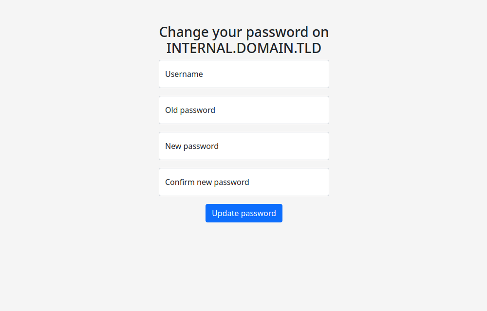

# Directory service password changer
## Overview
This application allows users to change directory service account password using a simple web interface.
It uses the Kerberos protocol to communicate with the directory service and tested with Microsoft Active Directory.  
### Features
- Simple and lightweight
- Supports multiple web interface languages
- Has responsive design and works on mobiles, tablets, and desktops
- Does not use any administrative accounts — works like a local workstation connected to a domain
- Allows you to change expired passwords
- Communicates with a directory service over the network — it can be deployed anywhere with network access to directory service
### Screenshot


## Installation and deployment
The deployment was tested on Arch Linux rolling.
### Requirements
- Python 3.9 and above;
- uWSGI with Python 3 plugin;
- Nginx with mod-headers-more and mod-brotli (modules are optional, but highly recommended);

Install system-wide requirements:
```
sudo pacman -S python nginx nginx-mod-brotli nginx-mod-headers-more uwsgi uwsgi-plugin-python
```

Create a new user `ds-password-changer` with the home directory `/opt/ds_password_changer`:
```
sudo mkdir /opt/ds_password_changer
sudo useradd -s /bin/false -d /opt/ds_password_changer ds-password-changer
sudo chown -Rc ds-password-changer /opt/ds_password_changer
sudo chmod -R 0755 /opt/ds_password_changer
```
Log in as previously created user, clone this repository, and then install the requirements:
```
sudo su - ds-password-changer -s /bin/bash
git clone https://github.com/drygdryg/ds_password_changer .
pip install -r requirements.txt
```
Configure application from the configuration example:
```
cp settings.example.ini settings.ini
vim settings.ini
exit
```
Production settings:

| Section | Setting | Description |
| --- | --- | --- |
| app | kerberos_realm | Kerberos realm for the connection to the DS. It must be resolvable and accessible
| app | protected_users | List of usernames who cannot change the password using the application
| logging | filename | Filename to write the log to
| logging | level | Logging level. Allowed levels: `debug`, `info`, `warning`, `error`, `critical`
| webpage | page_title | Title and header text on the web page
| webpage | language | Language of the web application interface. The following languages are currently available: en, ru, uk

Debugging/development/testing settings (Python build-in web server):

| Section | Setting | Description |
| --- | --- | --- |
| webserver | server | Server adapter to use
| webserver | host | Server host
| webserver | port | Server port

Install nginx configuration file and uWSGI Systemd service:
```
sudo cp -v /opt/ds_password_changer/contrib/ds-password-changer.service /etc/systemd/system/
sudo cp -v /opt/ds_password_changer/contrib/nginx.conf /etc/nginx/nginx.conf
sudo systemctl daemon-reload
```
Edit `/etc/nginx/nginx.conf`: replace `server_name`, `ssl_certificate` and `ssl_certificate_key` with the domain name or IP address and SSL certificate of your installation.  
Then, start the `ds-password-changer` and `nginx` services and enable them to initiate at boot time:
```
sudo systemctl enable --now ds-password-changer nginx
```
Finally, check the availability of the web interface on the specified domain name.

## Acknowledgements
- `jirutka` for the [ldap-passwd-webui](https://github.com/jirutka/ldap-passwd-webui)
- Arch Linux community for the [Active Directory integration article](https://wiki.archlinux.org/title/Active_Directory_integration)
- `bosha` for [this article](https://the-bosha.ru/2017/01/04/zapusk-flask-prilozheniia-c-uwsgi-virtualenv-i-nginx/)
